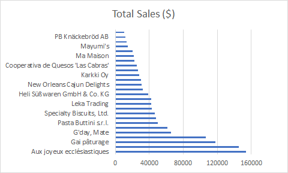
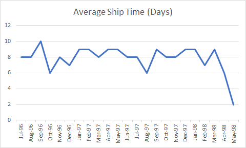

<h1 align="center"> SQL Mini Project Report</h1>

<br>

## Table of Contents

### [Question 1](#q1)
### [Question 2](#q2)
### [Question 3](#q3)


<div id='q1'/>

<br>

## Question 1 - Northwind Queries

1. _**Write a query that lists all Customers in either Paris or London. Include Customer ID, Company Name and all address fields.**_

##### Query
```sql
	SELECT c.CustomerID AS "Customer ID",
		c.CompanyName AS "Company Name",
		CONCAT(c.Address, ', ', c.City, ', ', c.PostalCode) AS "Address"
	FROM Customers c WHERE c.City IN ('Paris', 'London');
```

##### Response

| Customer ID |	Company Name		    | Address										|
|-------------|-------------------------|-----------------------------------------------|
| AROUT		  | Around the Horn		    | 120 Hanover Sq., London, WA1 1DP				|
| BSBEV		  | B's Beverages		    | Fauntleroy Circus, London, EC2 5NT		    |
| CONSH		  | Consolidated Holdings   | Berkeley Gardens 12  Brewery, London, WX1 6LT |
| EASTC		  | Eastern Connection	    | 35 King George, London, WX3 6FW				|
| NORTS		  | North/South	South House | 300 Queensbridge, London, SW7 1RZ				|
| PARIS		  | Paris spécialités		| 265, boulevard Charonne, Paris, 75012			|
| SEVES		  | Seven Seas Imports	    | 90 Wadhurst Rd., London, OX15 4NB				|
| SPECD		  | Spécialités du monde	| 25, rue Lauriston, Paris, 75016				|

2. _**List all products stored in bottles.**_

##### Query
```sql
    SELECT p.ProductName AS "Products Which Come in Bottles"
    FROM Products p WHERE p.QuantityPerUnit LIKE '%bottle%';
```

##### Response

| Products Which Come in Bottles   |
|----------------------------------|
| Chang							   |
| Aniseed Syrup					   |
| Genen Shouyu					   |
| Sasquatch Ale					   |
| Steeleye Stout				   |
| Côte de Blaye					   |
| Chartreuse verte				   |
| Sirop d'érable				   |
| Louisiana Fiery Hot Pepper Sauce |
| Laughing Lumberjack Lager		   |
| Outback Lager					   |
| Rhönbräu Klosterbier			   |

3. _**Repeat question above, but add in the Supplier Name and Country.**_

##### Query
```sql
    SELECT p.ProductName AS "Product Name",
           s.CompanyName AS "Supplier Name",
           s.Country
    FROM Products p
        INNER JOIN Suppliers s ON p.SupplierID = s.SupplierID
    WHERE p.QuantityPerUnit LIKE '%bottle%';
```

##### Response

| Product Name	                   | Company Name	                   | Country   |
|----------------------------------|-----------------------------------|-----------|
| Chang	                           | Exotic Liquids	                   | UK        |
| Aniseed Syrup	                   | Exotic Liquids	                   | UK        |
| Genen Shouyu	                   | Mayumi's	                       | Japan     |
| Sasquatch Ale	                   | Bigfoot Breweries	               | USA       |
| Steeleye Stout	               | Bigfoot Breweries	               | USA       |
| Côte de Blaye	                   | Aux joyeux ecclésiastiques        | France    |
| Chartreuse verte	               | Aux joyeux ecclésiastiques	       | France    |
| Sirop d'érable	               | Forêts d'érables	               | Canada    |
| Louisiana Fiery Hot Pepper Sauce | New Orleans Cajun Delights        | USA       |
| Laughing Lumberjack Lager	       | Bigfoot Breweries	               | USA       |
| Outback Lager	                   | Pavlova, Ltd.	                   | Australia |
| Rhönbräu Klosterbier	           | Plutzer Lebensmittelgroßmärkte AG | Germany   |

4. _**Write an SQL Statement that shows how many products there are in each category. Include Category Name in result set and list the highest number first.**_

##### Query
```sql
	SELECT c.CategoryName AS "Category Name",
		   COUNT(p.CategoryID) AS "Number of Products in Category"
	FROM Products p 
		INNER JOIN Categories c ON p.CategoryID = c.CategoryID
	GROUP BY c.CategoryID, c.CategoryName
	ORDER BY "No. of Items" DESC;
```

##### Response

| Category Name  | No. of Items |
|----------------|--------------|
| Confections    | 13           |
| Beverages      | 12           |
| Condiments     | 12           |
| Seafood        | 12           |
| Dairy Products | 10           |
| Grains/Cereals | 7            |
| Meat/Poultry   | 6            |
| Produce        | 5            |

5. _**List all UK employees using concatenation to join their title of courtesy, first name and last name together. Also include their city of residence.**_

##### Query
```sql
	SELECT CONCAT(e.TitleOfCourtesy, ' ', e.FirstName, ' ', e.LastName) AS "Name", 
		e.City AS "City of Residence"
	FROM Employees e
	WHERE e.Country = 'UK';
```

##### Response

| Employee Name       | City of Residence |
|---------------------|-------------------|
| Mr. Steven Buchanan | London            |
| Mr. Michael Suyama  | London            |
| Mr. Robert King     | London            |
| Ms. Anne Dodsworth  | London            |

6. _**List Sales Totals for all Sales Regions (via the Territories table using 4 joins) with a Sales Total greater than 1,000,000. Use rounding or FORMAT to present the numbers.**_

##### Query
```sql
    SELECT t.RegionID AS "Region ID",
        FORMAT(SUM(od.UnitPrice * od.Quantity * (1 - od.Discount)), 'C2', 'en-us') AS "Total Region Sales"
    FROM Territories t
        INNER JOIN EmployeeTerritories et ON t.TerritoryID = et.TerritoryID
        INNER JOIN Employees e ON et.EmployeeID = e.EmployeeID
        INNER JOIN Orders o ON e.EmployeeID = o.EmployeeID
        INNER JOIN [Order Details] od ON o.OrderID = od.OrderID
    GROUP BY t.RegionID
    HAVING SUM(od.UnitPrice * od.Quantity * (1 - od.Discount)) > 1000000
	ORDER BY t.RegionID;
```

Alternative approach using an advanced subquerey to avoid repeating the aggregate function.

```sql
	SELECT rs.RegionID AS "Region ID", rs."Total Region Sales"
	FROM
	( SELECT t.RegionID, FORMAT(SUM(od.UnitPrice * od.Quantity * (1 - od.Discount)), 'C2', 'en-us') AS "Total Region Sales"
		FROM Territories t
			INNER JOIN EmployeeTerritories et ON t.TerritoryID = et.TerritoryID
			INNER JOIN Employees e ON et.EmployeeID = e.EmployeeID
			INNER JOIN Orders o ON e.EmployeeID = o.EmployeeID
			INNER JOIN [Order Details] od ON o.OrderID = od.OrderID
		GROUP BY t.RegionID ) rs
	WHERE "Total Region Sales" > 1000000
	ORDER BY t.RegionID;
```

##### Response

| Sales Region ID | Sales Total   |
|-----------------|---------------|
| 1               | $2,730,198.01 |
| 2               | $1,615,248.00 |
| 3               | $1,048,605.58 |

7. _**Count how many Orders have a Freight amount greater than 100.00 and either USA or UK as Ship Country.**_

##### Query
```sql
	SELECT COUNT(o.OrderID) AS "No. of Orders With Freight > 100 and Ship to USA/UK"
	FROM Orders o WHERE o.Freight > 100 AND o.ShipCountry IN ('UK', 'USA');
```

##### Response

| No. of Orders With Freight > 100 and ship to USA/UK |
|-----------------------------------------------------|
| 49                                                  |

8. _**Write an SQL Statement to identify the Order Number of the Order with the highest amount(value) of discount applied to that order.**_

##### Query
```sql
	SELECT TOP 1 od.OrderID AS "Order Number",
		 FORMAT(SUM(od.UnitPrice * od.Quantity * od.Discount), 'C2', 'en-us') AS "Value of Discount"
	FROM [Order Details] od
	GROUP BY od.OrderID
	ORDER BY SUM(od.UnitPrice * od.Quantity * od.Discount), 'C2', 'en-us' DESC;
```

##### Response

| Order Number | Value of Discount |
|--------------|-------------------|
| 11030        | $3,706.85         |

<div id='q2'/>

<br>

## Question 2 - Table Creation

1. _**Write the correct SQL statement to create the following table:**_\
	_**Spartans Table – include details about all the Spartans on this course. Separate Title, First Name and Last Name into separate columns, and include University attended, course taken and mark achieved. Add any other columns you feel would be appropriate.**_

##### Query
```sql
	CREATE TABLE spartans_table
	(
		spartan_id INT IDENTITY(1, 1) PRIMARY KEY,
		first_name VARCHAR(15),
		last_name VARCHAR(15),
		university_name VARCHAR(15),
		course_taken VARCHAR(15),
		mark_achieved INT
	)
```

2. _**Write SQL statements to add the details of the Spartans in your course to the table you have created.**_

##### Query
```sql
	INSERT INTO spartans_table
	(first_name, last_name, university_name, course_taken, mark_achieved)
	VALUES
	('John', 'Smith', 'University of Birmingham', 'Comp Sci MSc', 100),
	('Adam', 'Adams', 'Imperial College London', 'Physics BSc', 90),
	('Matt', 'Jones', 'University of York', 'Mathematics BSc', 85),
	('Lisa', 'Smith', 'London School of Economics', 'Economics MSc', 95),
	('Matt', 'Carpenter', 'University of Nottingham', 'Chemistry MSc', 75),
	('Laura', 'Noris', 'University of Manchester', 'Geology BSc', 80),
	('Eric', 'Scott', 'University of York', 'Engineering MSc', 99);

	SELECT * FROM spartans_table;
```

#### Response

| spartan_id | first_name | last_name | university_name            | course_taken    | mark_achieved |
|------------|------------|-----------|----------------------------|-----------------|---------------|
| 1          | John       | Smith     | University of Birmingham   | Comp Sci MSc    | 100           |
| 2          | Adam       | Adams     | Imperial College London    | Physics BSc     | 90            |
| 3          | Matt       | Jones     | University of York         | Mathematics BSc | 85            |
| 4          | Lisa       | Smith     | London School of Economics | Economics MSc   | 95            |
| 5          | Matt       | Carpenter | University of Nottingham   | Chemistry MSc   | 75            |
| 6          | Laura      | Noris     | University of Manchester   | Geology BSc     | 80            |
| 7          | Eric       | Scott     | University of York         | Engineering MSc | 99            |

<div id='q3'/>

<br>

## Question 3 - Data Analysis

1. _**List all Employees from the Employees table and who they report to. No Excel required. Include Employee names and ReportTo names.**_

##### Query
```sql
	SELECT CONCAT(e.FirstName, ' ', e.lastName) AS "Employee's Name", 
		CONCAT(e2.FirstName, ' ', e2.LastName) AS "Superior's Name"
	FROM Employees e LEFT JOIN Employees e2 ON e.ReportsTo = e2.EmployeeID;
```

##### Response

| Employee Name    | Superior's Name |
|------------------|-----------------|
| Nancy Davolio    | Andrew Fuller   |
| Andrew Fuller    |                 |
| Janet Leverling  | Andrew Fuller   |
| Margaret Peacock | Andrew Fuller   |
| Steven Buchanan  | Andrew Fuller   |
| Michael Suyama   | Steven Buchanan |
| Robert King      | Steven Buchanan |
| Laura Callahan   | Andrew Fuller   |
| Anne Dodsworth   | Steven Buchanan |

2. _**List all Suppliers with total sales over $10,000 in the Order Details table. Include the Company Name from the Suppliers Table and present as a bar chart as below:**_

##### Query
```sql
	SELECT s.CompanyName AS "Company Name",
	ROUND(SUM(od.Quantity * od.UnitPrice * (1 - od.Discount)), 0) AS "Total Sales ($)"
	FROM Suppliers s 
		INNER JOIN Products p ON s.SupplierID = p.SupplierID
		INNER JOIN [Order Details] od ON p.ProductID = od.ProductID
	GROUP BY s.CompanyName, s.SupplierID
	HAVING SUM(od.Quantity * od.UnitPrice * (1 - od.Discount)) > 10000
	ORDER BY "Total Sales ($)" DESC;
```

Alternative approach using an advanced subquerey to avoid repeating the aggregate function.

```sql
	SELECT ts.CompanyName, ts."Total Sales ($)"
	FROM
	( SELECT s.CompanyName, ROUND(SUM(od.Quantity * od.UnitPrice * (1 - od.Discount)), 0) AS "Total Sales ($)"
		FROM Suppliers s
			INNER JOIN Products p ON s.SupplierID = p.SupplierID
			INNER JOIN [Order Details] od ON p.ProductID = od.ProductID
		GROUP BY s.CompanyName, s.SupplierID ) ts
	WHERE "Total Sales ($)" > 10000
	ORDER BY ts."Total Sales ($)" DESC;
```

##### Response

| Company Name                           | Total Sales ($)|
|----------------------------------------|----------------|
| Aux joyeux ecclésiastiques 	         | 153691         |
| Plutzer Lebensmittelgroßmärkte AG	     | 145372         |
| Gai pâturage	                         | 117981         |
| Pavlova, Ltd. 	                     | 106460         |
| G'day, Mate	                         | 65627          |
| Forêts d'érables 	                     | 61588          |
| Pasta Buttini s.r.l.	                 | 50255          |
| Formaggi Fortini s.r.l.	             | 48225          |
| Specialty Biscuits, Ltd. 	             | 46244          |
| Norske Meierier 	                     | 43142          |
| Leka Trading	                         | 42018          |
| Grandma Kelly's Homestead	             | 41953          |
| Heli Süßwaren GmbH & Co. KG	         | 38653          |
| Exotic Liquids	                     | 32188          |
| New Orleans Cajun Delights	         | 31168          |
| Tokyo Traders	                         | 30526          |
| Karkki Oy     	                     | 28443          |
| New England Seafood Cannery	         | 26591          |
| Cooperativa de Quesos 'Las Cabras' 	 | 25159          |
| Bigfoot Breweries 	                 | 22391          |
| Ma Maison	                             | 22155          |
| Svensk Sjöföda AB	                     | 20144          |
| Mayumi's	                             | 14737          |
| Nord-Ost-Fisch Handelsgesellschaft mbH | 13424          | 
| PB Knäckebröd AB                       | 11724          |
| Lyngbysild	                         | 10221          |

##### Analysis

Bar chart showing the Total sales for each company that is over $10K.

<p align="center">
	<a href="images/totalsales.png">
	
	</a>
</p>

3. _**List the Top 10 Customers YTD for the latest year in the Orders file. Based on total value of orders shipped. No Excel required.**_

##### Query
```sql
	SELECT TOP 10 c.CompanyName AS "Company Name", 
		ROUND(SUM(od.Quantity * od.UnitPrice * (1 - od.Discount)), 0) AS "Total Spent in YTD ($)"
	FROM Customers c
		INNER JOIN Orders o ON c.CustomerID = o.CustomerID
		INNER JOIN [Order Details] od ON o.OrderID = od.OrderID
	WHERE YEAR(o.ShippedDate) = 
			(SELECT MAX(YEAR(ShippedDate)) FROM Orders)
	GROUP BY c.CustomerID, c.CompanyName
	ORDER BY "Total Spent in YTD ($)" DESC;
```

##### Response

| Company Name                 | Total Spent in YTD |
|------------------------------|--------------------|
| QUICK-Stop                   | 37217              |
| Save-a-lot Markets           | 36310              |
| Ernst Handel                 | 31312              |
| Hanari Carnes                | 23821              |
| Hungry Owl All-Night Grocers | 20402              |
| Rattlesnake Canyon Grocery   | 19983              |
| Königlich Essen              | 19583              |
| White Clover Markets         | 15279              |
| Folk och fä HB               | 13644              |
| Suprêmes délices             | 11645              |

4. _**Plot the Average Ship Time by month for all data in the Orders Table using a line chart as below.**_

##### Query
```sql
    SELECT DISTINCT LEFT(CONVERT(char, o.OrderDate, 20), 7) AS "Date",
           AVG(DATEDIFF(day, o.OrderDate, o.ShippedDate))  AS "Average Ship Time (Days)"
      FROM Orders o
     GROUP BY LEFT(CONVERT(char, o.OrderDate, 20), 7)
     ORDER BY "Date";
```

##### Response

| Date    | Average Ship Time (Days) |
|---------|--------------------------|
| 1996-07 | 8                        |
| 1996-08 | 8                        |
| 1996-09 | 10                       |
| 1996-10 | 6                        |
| 1996-11 | 8                        |
| 1996-12 | 7                        |
| 1997-01 | 9                        |
| 1997-02 | 9                        |
| 1997-03 | 8                        |
| 1997-04 | 9                        |
| 1997-05 | 9                        |
| 1997-06 | 8                        |
| 1997-07 | 8                        |
| 1997-08 | 6                        |
| 1997-09 | 9                        |
| 1997-10 | 8                        |
| 1997-11 | 8                        |
| 1997-12 | 9                        |
| 1998-01 | 9                        |
| 1998-02 | 7                        |
| 1998-03 | 9                        |
| 1998-04 | 6                        |
| 1998-05 | 2                        |


##### Analysis

Line chart showing the Average Ship Time in Days each month.

<p align="center">
	<a href="images/averageshipdays.png">
	
	</a>
</p>